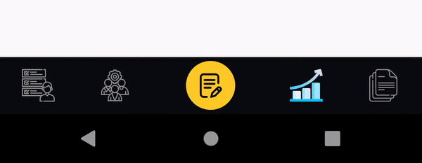

# Butter-Bottom-Nav
A simple bottom navigation library which is an easy way to create a bottom navigation bar. There are five items on the bar and you can customize them as you like.

# Installation
Add it in your root build.gradle at the end of repositories:
	
```groovy  
allprojects {
    repositories {
        maven { url 'https://jitpack.io' }
    }
}
```
  
Add the dependency: <a href="https://jitpack.io/#uLbyy/butter_bottom_nav"></a>

```groovy 
dependencies {
    implementation 'com.github.uLbyy:Butter-Bottom-Nav:$latest_version"
}
``` 

# Usage
Usage of the BottomNavigation widget is very easy. Just place it in your layout.xml like this:

```xml
<com.haslan.butterbottomnav.ButterBottomNavView
        android:id="@+id/butter_bottom_nav"
        android:layout_width="0dp"
        android:layout_height="wrap_content"
        app:butter_bottom_nav_background="@color/colorPrimary"
        app:butter_bottom_nav_center_button_background="@color/colorAccent"
        app:butter_bottom_nav_center_icon="@drawable/ic_center"
        app:butter_bottom_nav_tab_four_selector="@drawable/selector_tab_four"
        app:butter_bottom_nav_tab_one_selector="@drawable/selector_tab_one"
        app:butter_bottom_nav_tab_three_selector="@drawable/selector_tab_three"
        app:butter_bottom_nav_tab_two_selector="@drawable/selector_tab_two" />
```

You must specify selectors for each item in the layout. You can arrange any colors or shapes for items by creating selector xml files in drawable folder. You can design your bottom navigation as you wish. Below code is an example for tab one:

```xml
<selector xmlns:android="http://schemas.android.com/apk/res/android">
    <item android:drawable="@drawable/ic_tab_one_selected" android:state_activated="true" />
    <item android:drawable="@drawable/ic_tab_one" />
</selector>
```

Activity that you use is implemented by ButterBottomNavListener. In onCreate method ,you must call initListener method from navigation that 
you defined in layout. tabClicked and centerTabClicled methods must be implemented to your activity. You can add action features to 
items on bottom navigation when you click on them by using these methods. You should call tabPositionChanged method in tabClicked 
method so the tab position will change when you click another item on navigation. Moreover, you should implement sameTabClicked method
if you want to take different action from the item that you already clicked when you re-click it.

```
class MainActivity : AppCompatActivity(), ButterBottomNavListener {

    override fun onCreate(savedInstanceState: Bundle?) {
        super.onCreate(savedInstanceState)
        setContentView(R.layout.activity_main)
        butter_bottom_nav.initListener(this)
    }

    override fun tabClicked(tab: Int) {
        Toast.makeText(this, tab.toString(), Toast.LENGTH_SHORT).show()
        butter_bottom_nav.tabPositionChanged(tab)
    }

    override fun sameTabClicked(tab: Int) {
        Toast.makeText(this, "Same tab clicked", Toast.LENGTH_SHORT).show()
    }

    override fun centerTabClicked() {
        Toast.makeText(this, "Center tab clicked", Toast.LENGTH_SHORT).show()
    }
}
```
# Example

